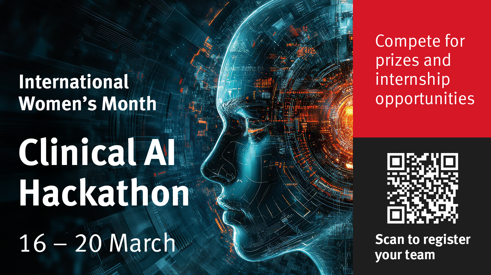
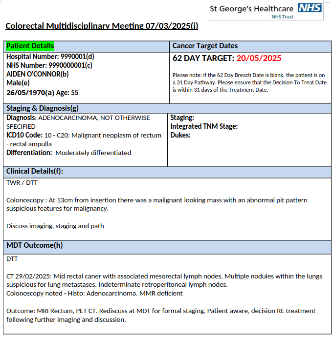
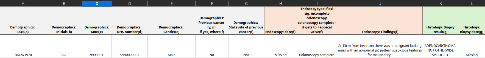
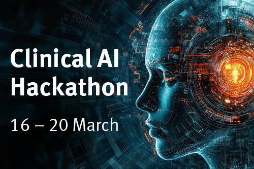

# Clinical AI Hackathon

- City St George's University of London
- 16-20 March 2026
- 74 signed up
- 32 finalists - 8 teams
- Majority MSc students
- 20 March coincided with Eid - a poor date choice

---

# Real-world problem

- Set by MOD and NHS clinicians
- 50 synthetic MDT records provided by the NHS
- Multidisciplinary Team (MDT) discussions record cancer-treatment decisions in unstructured documents
- Task: extract patient history and decisions into an Excel row to inform the next step in treatment

---

# Real-world problem, continued

- Success criterion: the spreadsheet accurately reflects the history in the source MDT documents; unknown fields remain empty
- Winning categories: Best solution, Best understanding, Overall winner
- The strongest work combined technical implementation with understanding of clinical context

---

# Lessons learnt

- Best results came from teams that used AI agents effectively: Gemini, Claude Code and Codex
- For non-subscribers, the best experience relied on the free Gemini student subscription; this was no longer available in October 2026
- The solution is easier to build than to deploy: NHS deployment requires consideration of DTAC and DCB0129/DCB0160
- A practical solution less dependent on regulation may have greater immediate value for the NHS

---

# Clinical AI Hackathon

- Thank you
- Questions?
- daniel.sikar@citystgeorges.ac.uk
- sevinj.teymurova@citystgeorges.ac.uk
- teymurs@richmond.ac.uk
